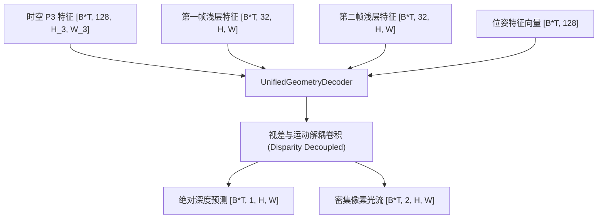

# 自研时空混合与三维物理几何头部专题 (custom_heads.md)

本专题深入剖析了为应对相机高速自运动、场景复杂运动及实例时序追踪而专门设计的自定义网络分支。这些自研头部网络与 YOLO 原生网络解耦放置，构成了整个自监督时空物理感知系统的“核心动力臂”。

---

## 1. 时空特征混合模块 (SpatioTemporalMambaBlock)

时空特征混合模块承载着序列维度（Chunk 级别）的时序信息交互与长距离几何关系捕获的物理职责。

### 1.1 傅里叶时间嵌入与自适应融合
* **绝对时间戳映射**：接收绝对时间戳 $t_{\text{abs}} \in [B, T, 1]$。由于神经网络对原始标量数值不敏感且易过拟合，我们利用**傅里叶正弦/余弦投影（Fourier Temporal Embedding）**将其投射到高维隐空间（128 维）：
  $$\text{Emb}(t) = \left[ \sin(\omega_1 t), \cos(\omega_1 t), \dots, \sin(\omega_D t), \cos(\omega_D t) \right]$$
* **多尺度自适应混合**：多尺度图像特征（P3, P4, P5）首先在 Spatial 维度进行平均下采样，输入 `SpatioTemporalMambaBlock` 完成序列维度的跨帧状态流动，随后经过双线性残差上采样恢复原尺寸并与输入特征相加。

### 1.2 Mamba 状态空间交互与 Mamba-Fallback 保护
* 在安装了 `mamba_ssm` 的 CUDA 生产环境中，本模块使用高效的选择性状态空间模型（Mamba）作为时序骨干，实现 $O(N)$ 计算复杂度的超长距离时序流动。
* 为了保障核心库的纯洁性且具备强大的无包部署兼容性，我们特别在 `models/custom_heads.py` 中实现了 **`TemporalConvFallback` (时间分组空洞卷积退化保护模块)**。当 Mamba 不可用时，自动无缝回退到带有空洞因子（dilation）和通道分组（groups）的 1D 时序卷积，确保序列在时间维度上依然能够流畅传播：
  $$\text{Conv1D}_{\text{temporal}}(X) = \text{GroupedConv1D}\left(\text{Pad}(X), \text{dilation}=2^d\right)$$

---

## 2. 密集绝对深度与光流联合解译器 (UnifiedGeometryDecoder)

`UnifiedGeometryDecoder` 负责在没有任何人工标注的前提下，仅依靠前后相邻帧图像，并行求解高精度单目绝对深度图与稠密像素级光流图。

### 2.1 视差解耦与多尺度交叉投影
* **输入多模态表征**：
  * 主干网络时空混合后的浅层特征图 $F_{\text{st}} \in [B \times T, 128, H_3, W_3]$
  * 浅层时序卷积提取的第一帧/第二帧特征 $F_1, F_2 \in [B \times T, 32, H, W]$
  * 由位姿头预测的相机自运动特征向量 $F_{\text{pose}} \in [B \times T, 128]$

### 2.2 绝对深度估计的指数激活与约束
为了绝对保证预测深度的物理合理性（避免输出负深度导致几何三维投影公式失真），我们对深度解码器的 Raw 输出进行严格的 **Exp-Clamping 指数激活映射**，限制输出的绝对深度在 $0.01\text{m}$ 至 $100.0\text{m}$ 之间：
$$D_{\text{pred}} = \exp\left( \text{Clamp}(D_{\text{raw}}, \min=-4.6, \max=4.6) \right)$$

---

## 3. 相机自运动估计网络 (EgoPoseHead)

`EgoPoseHead` 用于在连续时间序列中估计相机自身的旋转与平移参数，为后端的物理重投影（Warping）提供三维位姿变换矩阵。

### 3.1 6D 旋转矩阵回归与正交化
直接回归欧拉角（Euler Angles）存在万向节死锁（Gimbal Lock），而回归四元数（Quaternion）存在非凸球壳映射问题。
为了保证回归的数值稳定性，`EgoPoseHead` 采用了先进的 **6D 连续三维旋转表示法 (6D Rotation Representation)**。回归输出的前 6 个分量表示两个三维向量 $u_1, u_2 \in \mathbb{R}^3$，通过 Schmidt 正交化在 GPU 上极速构造出绝对正交的标准 $3 \times 3$ 旋转矩阵 $R$：
1. $v_1 = \text{Normalize}(u_1)$
2. $v_2 = \text{Normalize}\left(u_2 - (v_1 \cdot u_2)v_1\right)$
3. $v_3 = v_1 \times v_2$
4. $R = [v_1, v_2, v_3] \in \text{SO}(3)$

### 3.2 3D 位移向量与位姿图构建
输出的后 3 个分量直接表示平移向量 $T \in \mathbb{R}^3$。通过拼合 $R$ 和 $T$，构造出欧氏群中的变换矩阵：
$$T_{\text{cam}}^{(t \to t+1)} = \begin{bmatrix} R & T \\ \mathbf{0}^T & 1 \end{bmatrix} \in \text{SE}(3)$$

---

## 4. 物理特征动力学预测器 (FeaturePredictorHead)

`FeaturePredictorHead` 是用于评估物理异常检测（自监督）的专用网络：
* **设计初衷**：在遵守物理定律的正常世界中，下一时刻的物体/背景分布应该是相机自运动和历史惯性特征的连续动力学函数。
* **物理预测流**：
  * 接收前一时刻的时空混合特征 $S_t$ 和预测得到的相机位姿相对运动向量 $P_{t \to t+1}$。
  * 利用多层隐藏卷积与偏置映射，**预测出下一时刻本应出现的时空特征图 $\hat{S}_{t+1}$**。
  * 预测特征与真实未来时空特征的绝对偏差将作为物理异常值（Anomaly Map）进行输出，用以发现不受相机控制、具有异常自发运动的动态目标。

---

## 5. 实例追踪决策单元 (TrackQueryModule)

`TrackQueryModule` 实现了在时空特征上的高度稳定实例目标绑定与时序跟踪。

### 5.1 32 级持久化 Queries 机制
* 追踪网络内部维护了 32 个可学习的查询向量（Queries），容量相较传统检测器翻倍，能轻松容纳 MOVi-E 序列中的密集移动物体。
* 查询向量在 Chunk 的序列维度上进行时序演进与跨帧迭代，通过自注意力机制（Self-Attention）与时空特征图 P3 进行交叉注意力（Cross-Attention）交互：
  $$Q_{t+1} = \text{MultiHeadAttention}\left(Q_t, K=F_{\text{st}}^{(P3)}, V=F_{\text{st}}^{(P3)}\right)$$

### 5.2 追踪参数物理保障
* **GIoU 边界框正值保障**：对预测得到的边界框输出，加上严格的正值偏移保障，绝对杜绝了 GIoU 损失计算在训练初期的失真问题：
  $$\text{BBox}_{\text{valid}} = \text{Softplus}(\text{BBox}_{\text{raw}}) + 10^{-4}$$
* **回归输出**：并行输出 `track_boxes` (归一化中心坐标与宽高)、`track_classes` (类别概率)、`track_alive` (目标存活概率) 以及 `track_masks` (实例特征图，用以执行密集分割)。
