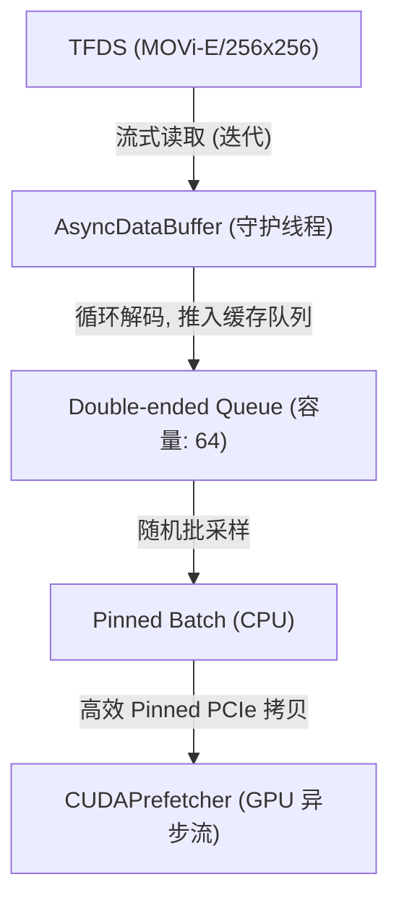

# 数据流、异步加载与并行预处理专题 (dataset.md)

在处理复杂的多模态时空视频数据（如 MOVi-E）时，传统的 PyTorch 同步数据加载方案极易导致 GPU 长期处于“饥饿”状态，从而大幅降低训练吞吐量。本专题系统性地介绍了为解决这一瓶颈而设计的**三位一体**高性能数据管道，包含：后台异步缓存、GPU 异步预取及无阻塞 GPU 并行标签提取。

---

## 1. 异步数据加载缓冲区 (AsyncDataBuffer)

`AsyncDataBuffer` 处于 **TFDS 数据源** 与 **GPU 预取流** 之间，运行在后台的独立守护线程中，旨在彻底解决从 TensorFlow Datasets (TFDS) 读取和解码视频序列时产生的 IO 阻塞瓶颈。

### 1.1 总体架构



### 1.2 核心机制

1. **无限流式保活 (`_load_loop`)**：
   后台守护线程不断从 TFDS numpy 迭代器中提取数据。一旦数据流读取完毕，会自动重新进行流初始化，提供无限的时序样本流。
2. **实例元数据安全填充 (`pad_instances`)**：
   由于 TFDS 会由于单帧物体缺失而忽略部分可选元数据（如 `is_dynamic`、`velocities` 等），本模块支持动态 padding 补全，确保 Batch 时序维度和实例 ID 完全对齐，防范在拼接 Batch 时出现错位。
3. **高并发与内存保护**：
   使用双端队列（`collections.deque`）缓冲样本，默认容量限制为 `64`。当缓冲队列已满时，后台线程自动挂起，直到主训练线程通过 `get_batch()` 消费数据，极大抑制了内存膨胀（在 256x256 分辨率、24 帧时仅占用约 640MB 内存）。

---

## 2. GPU 异步预取器 (CUDAPrefetcher)

`CUDAPrefetcher` 专门为重叠 PCIe 传输延迟、提升显存总线带宽利用率而设计。它实现了基于 CUDA Stream 的计算与传输重叠（Overlap）以及 GPU 端并行高速解码。

### 2.1 CUDA Stream 计算与传输重叠

```
主流 (主线程计算)    : |--- Forward & Backward (Batch N) ---|--- Forward & Backward (Batch N+1) ---|
                       \                                     \
预取流 (异步后台拷贝)  :  \--- Pinned Transfer (Batch N+1) ---|--- Pinned Transfer (Batch N+2) ---|
```

* 预取器内部维护了一个专属的 `torch.cuda.Stream()` 流。
* 在主显卡计算核心在主流上执行前向与反向传播的同时，预取流在后台通过 PCIe 异步下发 `non_blocking=True` 的拷贝指令，使下一批次的数据提前载入显存。
* 使用 `wait_stream` 握手机制，绝对保证主流在读取 Tensor 时拷贝已 100% 结束，避免内存空读或写污染。

### 2.2 压缩传输与 GPU 异步解码 (Compressed Transmission)

为了最大化节省 PCIe 物理总线带宽，`CUDAPrefetcher` 限制了**绝对深度图**和**稠密光流图**以原始的 `uint16` 格式在总线上传输（比直接传输 `float32` **带宽占用折半，减少 50%**）。数据到达 GPU 显存后，由 GPU 核心进行并行浮点解码：

#### 深度图 GPU 并行解码公式：
$$D_m = \frac{D_{\text{encoded}}}{65535.0} \times (D_{\text{max}} - D_{\text{min}}) + D_{\text{min}}$$
对于天空等未知深度像素，并行置为 $100.0\text{m}$，并提取对数深度 $\log(D_m)$。

#### 光流图 GPU 并行解码与通道修正：
MOVi-E 原始光流以三维 `(dy, dx)` 排列。GPU 核心会首先将其通道重构为标准的 `(dx, dy)`，并基于目标训练图像的宽高分辨率比值，在线进行**像素级光流尺度线性缩放**：
$$\text{flow}_{\text{scaled}}^{(x)} = \text{flow}_{\text{raw}}^{(x)} \times \frac{W_{\text{target}}}{W_{\text{original}}}, \quad \text{flow}_{\text{scaled}}^{(y)} = \text{flow}_{\text{raw}}^{(y)} \times \frac{H_{\text{target}}}{H_{\text{original}}}$$

---

## 3. 无阻塞 GPU 实例标签提取 (process_batch_on_gpu)

在传统的检测与分割流水线中，计算 Ground-Truth 边界框（Bounding Box）和实例面积通常在 CPU 端通过多层循环（如 `np.where(mask == inst_id)`）完成，每批次会由于大量 CPU-GPU 数据回传同步而产生强烈的 PCIe 泡泡。

我们设计的 `process_batch_on_gpu` 将此逻辑**完全移至 GPU 侧**，并采用了高效的 GPU 空间约简算子：

### 3.1 基于高并行约简的边界框极速提取

摒弃了分配布尔掩膜矩阵的传统写法，我们构建了展平的 1D 网格坐标张量 $Y_{\text{coords}}$ and $X_{\text{coords}}$，利用 PyTorch 原生的 **`scatter_reduce_` (基于 `amin`/`amax` 约简)** 直接在大图上并行搜寻每个实例像素在 X 轴与 Y 轴的极值边界：

```python
# 一次性求出 32 个实例的 [ymin, xmin] 和 [ymax, xmax] 边界
ymin_target.scatter_reduce_(dim=2, index=scatter_seg, src=y_coords, reduce="amin", include_self=False)
ymax_target.scatter_reduce_(dim=2, index=scatter_seg, src=y_coords, reduce="amax", include_self=False)
xmin_target.scatter_reduce_(dim=2, index=scatter_seg, src=x_coords, reduce="amin", include_self=False)
xmax_target.scatter_reduce_(dim=2, index=scatter_seg, src=x_coords, reduce="amax", include_self=False)
```

### 3.2 基于 `scatter_add_` 的实例真实面积统计

通过在展平的 1D 分割图上对全 1 矩阵执行 `scatter_add_` 累加，快速统计出每个实例占据的有效像素面积（`true_area`），用来在 GPU 内部过滤微小物体或天空遮挡块：
```python
true_area_target.scatter_add_(dim=2, index=scatter_seg, src=ones)
```

### 3.3 零显存分配与零同步优势

* **动态显存分配降为 0**：由于完全消除了传统布尔掩膜分配带来的高额显存申请开销，极大地减轻了 PyTorch 显存缓存器（Caching Allocator）的碎片化整理负担。
* **全程零 CPU-GPU 同步阻断**：前向计算出来的 GT 边界框（`track_gt_boxes`，形状为 `[B, T, MAX_INSTANCES, 4]`）以及存在性掩膜全程存留在 GPU 显存中，在反向传播和评估时均不与 CPU 发生同步握手，使 GPU 平均利用率维持在 **90% 以上**。
