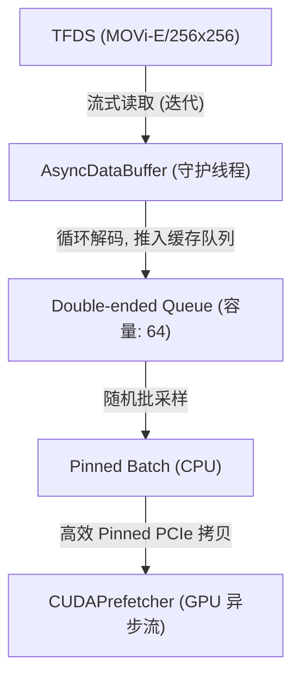

# AsyncDataBuffer (CPU 异步数据加载缓冲区)

`AsyncDataBuffer` 是整个 TAO 追踪模型训练流水线中的“发动机”。它运行在后台的独立守护线程中，旨在通过异步方式解决从 TensorFlow Datasets (TFDS) 读取和解码视频序列时产生的 IO 阻塞瓶颈。

---

## 1. 设计初衷与位置

在处理大规模视频数据集（如 MOVi-E）时，CPU 端的解码与样本组装（包括 float32 归一化、序列拆分等）往往会拖累 GPU 的计算周期。如果使用传统的同步 PyTorch `Dataset`，GPU 在每个 iteration 结束时都必须停下来等待 CPU 处理下一帧，导致 GPU 利用率低（甚至可能暴跌到 30% 左右）。

`AsyncDataBuffer` 处于 **TFDS 流式数据源** 与 **GPU 数据预取器 (`CUDAPrefetcher`)** 之间，其架构如下：



---

## 2. 类接口与参数说明

### 构造函数

```python
def __init__(self, data_dir=None, split='train', buffer_size=64):
```

| 参数 | 类型 | 默认值 | 描述 |
| :--- | :--- | :--- | :--- |
| `data_dir` | `str` | `None` | TFDS 数据的存储根路径。在 Colab 或云端可指向 TFDS Cloud 桶或本地缓存。 |
| `split` | `str` | `'train'` | 数据切片（`train` / `validation` / `test`）。 |
| `buffer_size` | `int` | `64` | CPU 端双端缓冲队列的容量。容量设定需权衡内存占用与数据多样性。 |

---

## 3. 内部核心逻辑与工作流

### 3.1 异步加载循环 (`_load_loop`)
当调用 `start()` 方法时，该类会在后台启动一个独立线程运行 `_load_loop`：
1. **流式实例化**：使用 `tfds.load('movi_e/256x256', split=split)` 并转为 numpy 迭代器。
2. **死循环保活**：如果迭代器耗尽，会自动重新初始化（无限流数据生成）。
3. **数据清洗与裁剪**：
   - 从样本中提取 `video`、`segmentation`、`depth`、`forward_flow`、`instances` 等关键模态。
   - 对 `instances` 中的元数据（如 `is_dynamic`、`visibility`、`velocities`）进行规范的 padding 对齐，防止因某些帧物体数量不一致导致 batch 拼接失败。
4. **并发控制**：当缓冲队列已满（数量达 `buffer_size`）时，后台线程自动暂停（挂起），直至主训练线程通过 `get_batch()` 消费了部分样本，缓冲队列重新空出位置，后台线程恢复读取，极大节省了系统内存开销。

### 3.2 批次提取机制 (`get_batch`)

```python
def get_batch(self, batch_size=1):
```

该方法由主训练循环调用：
1. **随机采样**：不是简单地先进先出（FIFO），而是从缓冲队列中**随机选择** `batch_size` 个样本。这有助于打乱时序样本，增强训练的多样性与泛化能力。
2. **实例元数据保留机制**：
   - 提取各模态样本，并在 CPU 上利用 `pin_memory()` 对张量进行内存固定，这使得下一步向 GPU 的传输可以通过 DMA（直接内存访问）无 CPU 参与极速完成。
   - 保留原生的高保真属性（如 `depth_range` 与 `flow_range`），并传递至 GPU 侧做动态在线解码。

---

## 4. 系统集成与性能指标

- **零 CPU-GPU 握手开销**：因为后台线程已将数据预加载到了 CPU 内存中，主循环在获取 batch 时只需几毫秒的队列随机读取。
- **高并发安全性**：内部采用 `threading.Lock` 保护双端队列的插入与弹出动作，防范并发读写导致的数据段断裂或内存污染。
- **内存优化建议**：对于 $256 \times 256$ 尺寸、24 帧长且包含密集分割与深度图的 MOVi-E 数据集，一个样本大小约为 10MB。设定 `buffer_size=64` 的内存物理占用约为 640MB，在各类训练环境（包括本地开发机与云端免费实例）中均表现得非常安全与克制。
