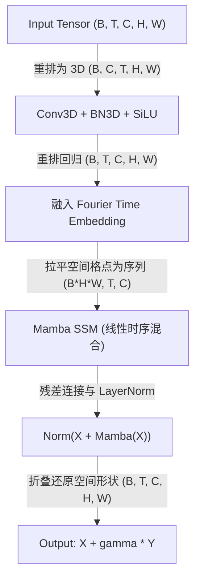

# SpatioTemporalMambaBlock (时空状态空间 Mamba 混合块)

`SpatioTemporalMambaBlock` 是模型中用于在时间序列上混合空间表征信息的关键核算模块。它通过引入时序自适应傅里叶时间嵌入（Adaptive Fourier Time Embedding）与线性复杂度状态空间模型（Selective State Space Model，Mamba），赋予了特征图在时间维度上的平滑连续性。

---

## 1. 设计初衷与位置

在视频分析和时序物理学习中，传统的 3D 卷积（3D Conv）或 Transformer（Self-Attention）存在严重的计算局限性：
- **3D 卷积**：时间感受野极小，无法捕捉跨越数十帧的长期物理规律。
- **Transformer**：自注意力计算复杂度随序列长度 $T$ 呈二次方增长（$\mathcal{O}(T^2)$），导致长序列显存崩塌。

`SpatioTemporalMambaBlock` 另辟蹊径：
- 采用 **Mamba 架构**（选择性状态空间），实现了对时间序列的**线性复杂度 $\mathcal{O}(T)$** 混合。
- 空间特征首先通过 3D 深度可分离卷积进行空间局域平滑，然后将各像素空间格点拉平为独立的“时序序列”送入 Mamba，最终在时间轴上实现特征的高度混合与平滑流转。

---

## 2. 类接口与参数说明

### 构造函数

```python
def __init__(self, channels, num_frequencies=16):
```

| 参数 | 类型 | 默认值 | 描述 |
| :--- | :--- | :--- | :--- |
| `channels` | `int` | - | 特征通道数（P3 阶段为 128，P4 为 256，P5 为 512）。 |
| `num_frequencies` | `int` | `16` | 自适应傅里叶时间编码的频带数。用于产生高保真的绝对时间基。 |

---

## 3. 核心机制与数学流向

`SpatioTemporalMambaBlock` 的前向传播流程如下：



### 3.1 自适应傅里叶时间嵌入 (Adaptive Fourier Time Embedding)
为了让 Mamba 在并行执行时感知时间间隔的物理尺度（例如 $\Delta t$ 发生突变时的速度估计），引入了基于连续正弦和余弦频带的时间编码：
1. **频带生成**：在初始化时注册固定的几何级数频带缓冲：
   $$\text{frequencies} = \exp(\text{linspace}(-5, 3, \text{num\_frequencies}))$$
2. **多频正弦嵌入**：对于绝对时间戳张量 $t$（形状为 `[B, T]`）：
   $$\text{scaled\_time} = t \times \text{frequencies} \quad \text{shape: } [B, T, F]$$
   $$\text{fourier\_feats} = [\sin(\text{scaled\_time}), \cos(\text{scaled\_time})] \quad \text{shape: } [B, T, 2F]$$
3. **MLP 特征投影**：经由 `time_mlp` 将频率特征线性映射为 `channels` 维，并广播加到 3D 空间特征图的每一个坐标格点上，使网络自带物理时间流逝感。

### 3.2 展平空间状态空间计算
为使 Mamba 聚焦于时间维度的演进，对张量形状进行极富智慧的重组：
- 将通道数重排为 `[B * H * W, T, C]`。
- 每一个三维格点坐标 $(b, h, w)$ 上的时序特征演变被视作一个独立的 $T$ 长度的时间序列序列，送入 `Mamba`（Selective SSM）进行线性迭代状态融合。
- **降级保护**：如果系统环境中未安装原生高性能 CUDA `mamba_ssm` 算子，在独立的 Mock 测试环境中，该类可以自适应热注入 `MockMamba`（采用可学习的线性映射），以保证非 GPU 调试场景下的闭环可通性，而生产环境则彻底纯净化直连原生 Mamba。
