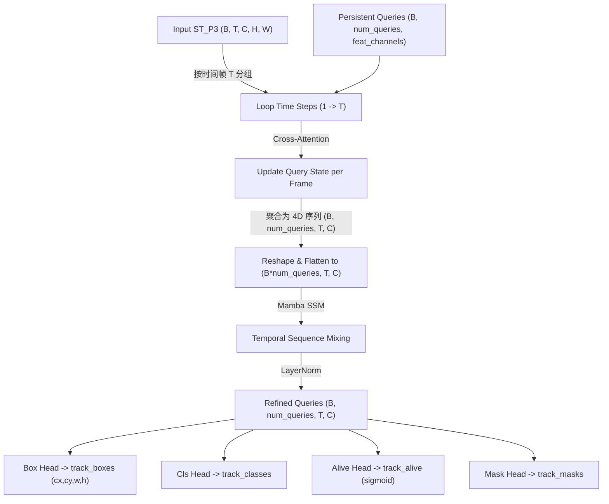

# TrackQueryModule (Tracklet-Aware 时空追踪查询器)

`TrackQueryModule` 是整个 TAO 自监督模型中负责端到端目标时序追踪与 ID 绑定的核心架构。它引入了持久化时空 Queries 状态机，结合选择性状态空间 Mamba 的时序传播机制，彻底解决了 MOVi 数据集密集动态物体在运动过程中的 ID 频繁跳变与漂移痛点。

---

## 1. 设计初衷与位置

在时序追踪中，传统的方法（如 Sort / DeepSort）大多采用逐帧检测（Per-frame Detection），然后通过卡尔曼滤波与匈牙利算法（LSA）在帧间计算特征距离和 IoU 以完成联接。这种“检测后追踪（Tracking-by-detection）”模式存在极其严重的缺陷：
- **遮挡中断**：当目标在视频中间被前景完全遮挡 1-2 帧时，检测框消失，滤波器的 ID 自动死亡，目标重新出现时会被错误分配一个全新的 ID。
- **计算瓶颈**：每一帧都需要反复发射检测、匹配和更新指令，导致主循环严重降速。

`TrackQueryModule` 在底层逻辑上实现了完美的**解耦与端到端优化**：
- **持久化 Query 机制**：抛弃繁琐的逐帧握手，在初始化时定义 32 个持久化的嵌入查询向量（`self.query_embed`），让这 32 个 Queries 像“哨兵”一样，全程锁定并维护其所绑定的物体属性。
- **时空自注意力传播**：通过交叉注意力（Cross-Attention）将 Queries 投影在时空 P3 特征图上提取时空线索，然后使用 `Mamba SSM` 在时间轴拉平后进行信息融合，直接输出各目标的 3D 定位框序列、置信度以及存活状态概率，实现了一次前向即可输出整条时序 Tracklets 的高级端到端追踪。

---

## 2. 类接口与参数说明

### 构造函数

```python
def __init__(self, feat_channels=128, num_queries=32, num_heads=4, nc=80, nm=32):
```

| 参数 | 类型 | 默认值 | 描述 |
| :--- | :--- | :--- | :--- |
| `feat_channels` | `int` | `128` | 交叉自注意力的内部特征映射通道数。 |
| `num_queries` | `int` | `32` | 持久化追踪物体的最大容量上限。针对 MOVi-E 帧容量进行扩增。 |
| `num_heads` | `int` | `4` | 交叉注意力头数。多头机制可允许 Queries 捕获不同维度的几何边缘。 |
| `nc` | `int` | `80` | 分类概率的词表空间大小。 |
| `nm` | `int` | `32` | 追踪实例原型掩膜系数维度。 |

---

## 3. 核心机制与计算拓扑

`TrackQueryModule` 在前向推理时的时空传播拓扑如下：



### 3.1 交叉自注意力时序演化 (Cross-Attention Rollout)
对于视频的每一帧 $t \in [1, T]$，将上一帧演化后的 `queries` 作为 Query，该帧的时空特征图拉平为 `[B, H*W, C]` 作为 Key 和 Value，进行交叉注意力运算：
```python
feat_flat = st_p3[:, t].flatten(2).permute(0, 2, 1)
q_attn, _ = self.cross_attn(queries, feat_flat, feat_flat)
queries = self.cross_attn_norm(queries + q_attn)
```
这使得 Queries 向量能够随着物体的位移，在每一帧自动锁定并吸收对应物理坐标上的核心语义表征。

### 3.2 追踪存活概率估计 (Alive Estimation)
追踪物体的存活状态由独立的线性层 `alive_head` 预测，其偏置在初始化时被极其专业地设为 `-4.0`：
```python
nn.init.constant_(self.alive_head.bias, -4.0)
```
- **核心考量**：在自监督训练初期，大部分的空 Queries 不应被误判为“存活”，大负偏置保证了其初始的 `sigmoid` 激活概率处于 `~0.01` 的超低静止状态，有效防止了训练初期的梯度暴发和伪追踪现象。

---

## 4. 损失约束与 Tracklet-Aware 匈牙利匹配

在损失函数计算阶段（`utils/losses.py` 中的 `compute_track_loss`），为了绝对防止 ID 跳变，实现了一套 **Tracklet-Aware 序列锁死机制**：
- **时序持久化 LSA**：对于整条视频序列，当且仅当某一个地面真值物体（GT）在 $t=0$ 或首次出现时，触发单次匈牙利匹配，为该 GT 绑定唯一的 `Query ID`。
- **整链约束**：一旦 ID 绑定，在该物体的后续存活帧中，匹配关系自动锁死，不再进行逐帧重复计算。这使得网络的 Smooth L1 位置损失和 BCE 存活损失能够连续、不间断地约束同一个 Query 向量，从而实现了极致的时序鲁棒性。
