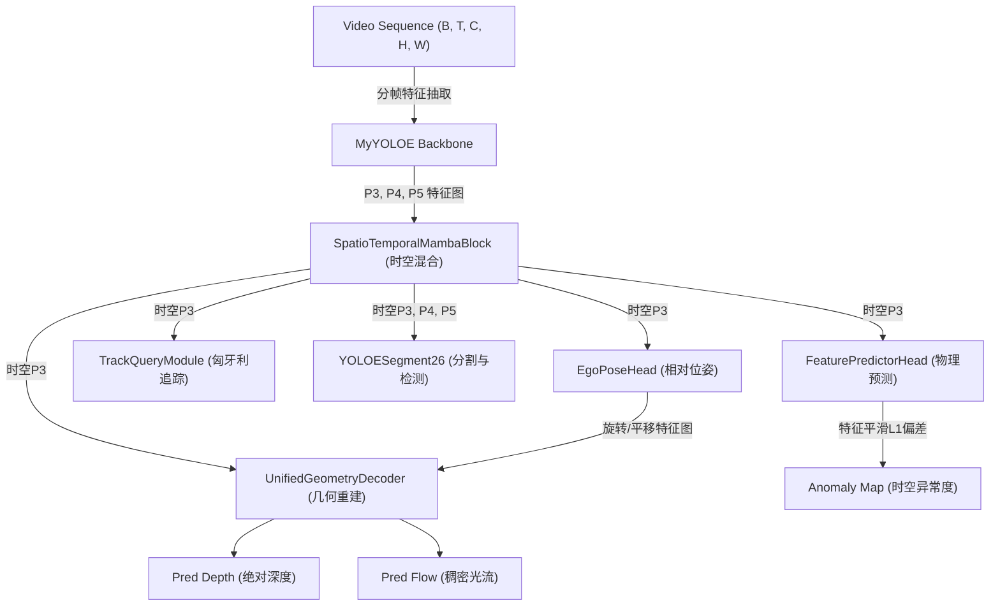

# TAONot42VisionModel (时空追踪与几何物理联合视觉大模型)

`TAONot42VisionModel` 是整个项目的核心大脑与网络终极封装。它将二维图像特征提取（`MyYOLOE`）、时空序列动态特征混合（`SpatioTemporalMambaBlock`）、物理三维几何解码（`UnifiedGeometryDecoder`）、相机自运动估计（`EgoPoseHead`）、自监督异常检测（`FeaturePredictorHead`）以及时空追踪（`TrackQueryModule`）完美地编织在一起。

---

## 1. 系统架构概览

该模型并非简单的单向串联，而是一个高度并行的多层任务估计系统。在前向传播物理逻辑 `forward_physics()` 中，模型的计算拓扑如下：



---

## 2. 类接口与内部子组件说明

### 2.1 初始化参数与组件列表

```python
def __init__(self):
```

模型初始化时不接收外部参数，其内部自动构建全套的时空物理结构：

| 组件名称 | 对应类 | 通道数与配置 | 物理职责 |
| :--- | :--- | :--- | :--- |
| `self.segmenter` | `MyYOLOE` | Backbone | 二维多尺度空间表征与分割金字塔提取器。 |
| `self.st_block` | `SpatioTemporalMambaBlock` | 128 | 融合 P3 高分辨率特征的时空序列时序混合器。 |
| `self.st_block_p4` | `SpatioTemporalMambaBlock` | 256 | 融合 P4 特征的时序混合器。 |
| `self.st_block_p5` | `SpatioTemporalMambaBlock` | 512 | 融合 P5 深层特征的时序混合器。 |
| `self.geom_decoder` | `UnifiedGeometryDecoder` | P3: 256, F2: 96, F1: 48 | 几何物理译码器，并行输出绝对深度与稠密光流。 |
| `self.pose_head` | `EgoPoseHead` | In: 128, Out: 9 | 相机连续相对运动（Ego-Pose，旋转与平移）预测头。 |
| `self.feature_predictor` | `FeaturePredictorHead` | In: 128 + 9, Out: 128 | 时空特征动力学预测网络（基于历史与动作预测下一帧）。 |
| `self.state_update_gate_head` | `nn.Sequential` | In: 128, Out: 1 | 门控自适应更新参数预测，输出物理状态更新置信度。 |
| `self.track_module` | `TrackQueryModule` | Queries: 32, Feat: 128 | **Tracklet-Aware 时空追踪器（含 32 个持久化 Queries）**。 |

---

## 3. 核心前向物理推理流 (`forward_physics`)

```python
def forward_physics(self, f1, f2, p3_fused, p4, p5, dt, step, get_loss_weights_fn=None, original_shape=None, tgts=None):
```

### 3.1 物理内参及绝对时间戳计算
在前向传播开始时，根据时间步长偏移 `dt` 计算绝对时间戳 $t_{\text{abs}}$：
$$t_{\text{abs}}^{(k)} = t_0 + \sum_{i=1}^{k} dt_i$$
其中 $t_0 \sim \mathcal{U}(0, 1000)$，用以防范时序绝对位置过拟合。

### 3.2 跨尺度时空混合 (Spatio-Temporal Mamba)
为了在保持计算效率的同时融合长距离时序关联，各尺度特征先经过下采样，输入 `SpatioTemporalMambaBlock` 混合，再通过双线性插值残差上采样恢复原分辨率：
```python
pooled = F.avg_pool2d(p_feat.flatten(0, 1), 2, 2)
st_out = block(pooled, t_abs)
p_feat = p_feat + F.interpolate(st_out.flatten(0, 1), size=(H, W), mode="bilinear")
```

### 3.3 物理逆向 Warp 几何约束
将 `pose_head` 输出的相机相对运动 ego-pose 作为导向，同浅层时序卷积特征 `f1_t` 和 `f2_t` 送入几何解码器，输出的深度与光流将用于后端的**光度误差损失（Photometric Loss）**计算，这迫使网络在不依赖人工标注的情况下自我理解真实的物理三维深度和相对速度。

### 3.4 追踪与时空异常估计
- **Spatio-Temporal Anomaly Detection**：通过 `feature_predictor` 预测 $T$ 时刻应有的物理特征，并与真实的 $T$ 时刻时空特征进行 L1 对比，差值作为 `anomaly_map` 异常图输出（用以发现不规则的运动物体）。
- **Persistent Tracking Queries**：通过 `track_module` 提取多尺度时空特征，完成对 32 个运动物体的时序绑定与位置追踪。
