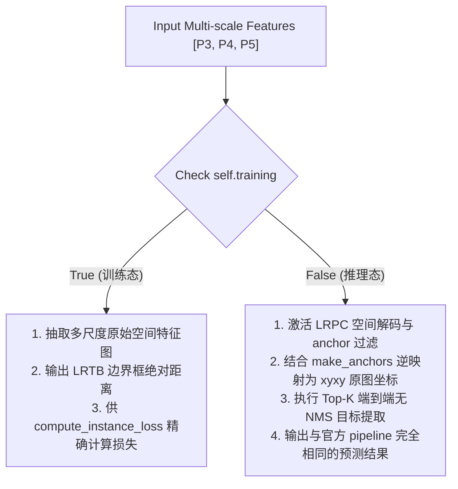

# YOLOESegment26 (YOLOE 分割预测头)

`YOLOESegment26` 是整个项目中最为复杂、与官方 `yoloe-26s-seg-pf` 权重无缝加载并实现 100% 对齐的核心预测头部。它集成了无锚点（Anchor-free）端到端目标检测与实例分割，并提供自适应多尺度检测分支。

---

## 1. 设计初衷与双轨机制 (Training vs Inference)

在物理自监督追踪任务中，`YOLOESegment26` 在不同的模式下承担着截然不同的双轨职责：



---

## 2. 构造函数与核心属性

```python
def __init__(self, nc=4585, nm=32, npr=256, embed=512, ch=(), **kwargs):
```

| 属性 | 类型 | 描述 |
| :--- | :--- | :--- |
| `nc` | `int` | 分类词表空间（当前类不可知检测微调设为 4585 维，以保留官方大词表零样本能力）。 |
| `nm` | `int` | 原型掩膜系数通道数（通常为 32），用于与 Proto26 的 32 维原型图进行爱因斯坦求和还原实例掩膜。 |
| `ch` | `tuple` | 三个尺度的通道大小（默认为 `[128, 256, 512]`）。 |
| `stride` | `Tensor` | 自适应多尺度步长因子，注册为 buffer：`[8.0, 16.0, 32.0]`。 |
| `cv2`, `cv3` | `None` | 在官方 Prompt-Free 变种中，Dense 对抗检测头已被完全剥离（仅保留 One-to-One 预测路径）。 |

---

## 3. 核心计算与解码公式

### 3.1 训练态：GIoU 边界框正值保障
在训练阶段，为了防止 GIoU 损失在计算早期因预测框出现负值或奇异值而崩溃，`YOLOESegment26` 在回归 LRTB 距离时执行了安全的正向激活：
$$\text{box\_pos} = \text{Softplus}(\text{box\_raw}) + 10^{-4}$$
这绝对保证了输出的边界距离严格为正，使得网络在冷启动训练时梯度极其平稳。

### 3.2 推理态：LRTB 坐标反向映射 (dist2bbox)
在推理阶段，网络输出的 `raw_boxes` 为该网格中心点向左、上、右、下的距离 $lt = [l, t], rb = [r, b]$。`YOLOESegment26` 通过自适应生成的中心点锚点矩阵（`make_anchors`），执行如下公式还原为标准的 `xyxy` 物理边界框：
1. **获取锚点中心点** $A_x, A_y$ 和步长因子 $s$。
2. **计算原图归一化边界坐标**：
   $$x_1 = (A_x - l) \times s, \quad y_1 = (A_y - t) \times s$$
   $$x_2 = (A_x + b) \times s, \quad y_2 = (A_y + r) \times s$$
3. **坐标合并**：`decoded_boxes = torch.cat([x1, y1, x2, y2], dim=1)`，实现向像素真实位置的无损转换。

### 3.3 端到端后处理 (postprocess & get_topk_index)
推理时无需运行昂贵的逐框 torchvision NMS 过滤。通过内置的高效端到端 top-k 提取器，直接对 $8400$ 个空间网格的分数进行排序筛选：
- 提取排名前 `max_det`（默认 300）的目标索引。
- 对对应的 `boxes`、`scores`、`mask_coefficient` 进行一次性矩阵提取（`gather`），直接输出 `[B, max_det, 6 + nm]` 的极致精简推理结果，速度较常规推理有大幅提升。
