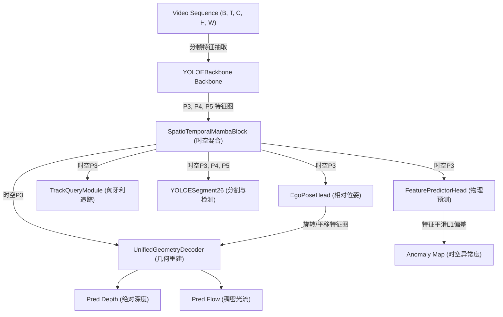
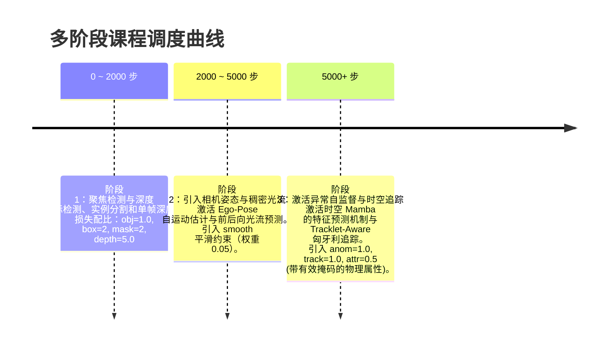

# 系统整机集成、自监督损失与课程学习专题 (system_integration.md)

本专题系统性地介绍了大模型的整机网络前向组装（TAONot42VisionModel）、多阶段自适应课程训练控制（TAOTrainer）、物理自监督几何重投影损失，以及面向高稳定性追踪的 Tracklet-Aware 匈牙利时空损失。

---

## 1. 统一视觉大模型整机集成 (TAONot42VisionModel)

`TAONot42VisionModel` 是整个感知大模型的大脑，负责将底层的二维图像特征提取（`YOLOEBackbone`）、时空序列动态特征混合（`SpatioTemporalMambaBlock`）、绝对三维几何解码（`UnifiedGeometryDecoder`）、相机自运动估计（`EgoPoseHead`）、自监督异常检测（`FeaturePredictorHead`）以及时空追踪（`TrackQueryModule`）完美地编织在一起。

### 1.1 系统架构与前向拓扑

### 1.2 分离设计与统一拼装
在 `forward_physics` 阶段：
1. **时空特征提取与多尺度混合**：输入分帧视频，通过 `YOLOEBackbone` 快速提取多尺度特征，送入时空 Mamba 模块进行状态时序混合，得到时空表征特征图（P3_fused, P4, P5）。
2. **YOLO 检测与分割**：将混合特征展开送入对齐的 `YOLOESegment26` 头中，预测类别、边界框及分割系数。
3. **几何反投影与三维重建**：结合 Ego-Pose 自运动参数与时空浅层卷积，在 `UnifiedGeometryDecoder` 中输出稠密深度与前后帧像素光流。
4. **自监督特征动力学预测**：依靠 `FeaturePredictorHead` 通过历史状态和位姿预测下一刻特征图，与真实未来图做 L1 距离比对，计算异常特征偏置。
5. **实例时空追踪**：利用 32 个持久化 Queries 并行提取追踪特征并计算匹配边界框及概率。

---

## 2. 多阶段自适应课程训练器 (TAOTrainer)

物理常识与三维几何关系的无监督学习极难在单一阶段或单一损失下直接收敛。`TAOTrainer` 担当“交响乐指挥家”，负责多阶段课程训练、在线评估诊断及训练性能极致优化。

### 2.1 三阶段动态课程调度 (Curriculum Loss Scheduling)

### 2.2 极致去同步化与 GPU 高效利用

为了确保英伟达 GPU 带宽利用率在自监督大模型训练中持续维持在 **90% 以上**，本模块实现了以下极致优化运行路径：
* **零阻断日志系统**：在主训练循环内，将反向传播计算所得的损失浮点数作为 `detached GPU Tensor` 累加。彻底清除了高频的 `.item()` 主机-设备（Host-Device）阻塞同步。只有在每 10 步的日志打印迭代中，才将累加的 Tensor 批量在 CPU 端转换一次，消除了 PCI-e 传输瓶颈。
* **在线自诊断度量评估 (Diagnostic Metrics)**：在没有标注的训练过程中，利用 GPU 在线实时估算预测与真实的 **AbsRel (绝对相对深度误差)**、**RMSElog (对数均方根误差)**、**EPEpx (像素级光流终点误差)**，实时评估物理自监督的收敛健康度。

---

## 3. 自监督三维几何与光度重投影损失

在无标注单目视觉下，模型通过建立前后两帧在三维空间中的投影等价关系来计算自监督损失：

### 3.1 物理反投影 Warping 与 SSIM 光度损失
* **三维投影建立 (`inverse_warp`)**：
  给定当前时刻图像 $I_t$，预测的绝对深度图 $D_t$，相机自运动位姿变换矩阵 $T_{t \to t+1}$ 以及相机内参矩阵 $K$。
  1. 我们首先将 $I_t$ 的二维像素坐标 $p_t = [u, v, 1]^T$ 乘以绝对深度 $D_t(p_t)$，利用相机内参逆矩阵反投影回三维相机坐标系下的 3D 点云 $P_t = [X, Y, Z]^T$：
     $$P_t = D_t(p_t) \cdot K^{-1} p_t$$
  2. 根据预测的相对位姿将点云变换到下一时刻坐标系：
     $$P_{t+1} = R_{t \to t+1} P_t + T_{t \to t+1}$$
  3. 将变换后的点云重新正投影回下一时刻的图像二维网格坐标 $p_{t+1}$ 上：
     $$p_{t+1} = K P_{t+1}$$
  4. 利用重投影得到的采样网格 $p_{t+1}$ 对未来帧图像 $I_{t+1}$ 执行双线性插值采样，重构出逆向 warped 图像 $\hat{I}_t$。
* **SSIM 混合光度一致性损失 (Photometric Loss)**：
  通过比对原始图像 $I_t$ 与 warped 重构图像 $\hat{I}_t$ 之间的结构相似度与绝对差值，强迫模型理解空间的三维深度与自运动结构：
  $$\mathcal{L}_{\text{photo}} = \alpha \cdot \frac{1 - \text{SSIM}(I_t, \hat{I}_t)}{2} + (1 - \alpha) \cdot \|I_t - \hat{I}_t\|_1$$

### 3.2 边缘感知深度平滑损失 (Edge-Aware Smoothness Loss)
为了防止深度预测图在纹理平坦的区域出现大范围杂乱突变，但在物体边缘处保持清晰分界，引入了边缘感知的二阶梯度平滑损失。当原始图像的局部颜色变化较小时，对深度图的局部梯度惩罚增大；反之，若图像边缘颜色变化剧烈（代表真实的边界），则减小对深度的平滑惩罚：
$$\mathcal{L}_{\text{smooth}} = \left| \partial_x D \right| e^{-\left| \partial_x I \right|} + \left| \partial_y D \right| e^{-\left| \partial_y I \right|}$$

---

## 4. 时序稳定 Tracklet-Aware 匈牙利追踪损失

在进行多尺度实例追踪时，直接为每帧独立求解匈牙利匹配会由于物体遮挡或短暂重叠而导致实例 ID 频繁跳变（ID Switch）。我们特别设计了持久化 **Tracklet-Aware 追踪状态匹配机制**：

### 4.1 持久化 ID 时序绑定与关联
* 在一段 Chunk 时序序列（长度为 24 帧）中，模型在首帧对 32 个 Query 向量执行全局匈牙利线性匹配（Linear Sum Assignment）。
* **匹配持久化**：在随后的时序传播中，凡是上一时刻已经匹配并成功绑定的实例，**其 ID 映射关系将强行锁定**，仅对新产生的 GT 实例触发新一轮的匈牙利匹配关联。
* 这绝对保障了同一个物体在其生命周期内始终牢牢绑定到同一个 Query 插槽上，大幅降低了追踪 ID 跳变。

### 4.2 向量化损失合并发射
* 为了最小化由于逐物体计算损失带来的 PyTorch 算子发射高额延迟，我们将所有绑定的存活实例在其对应的帧位置切片汇总。
* 在 CPU 上集中收集切片索引，最终在循环外**单次发射向量化** Smooth L1（用于边界框坐标回归）与 BCE（用于存活置信度评估）算子：
  $$\mathcal{L}_{\text{track}} = \sum_{k \in \text{active}} \text{SmoothL1}\left( B_{\text{pred}}^{(k)}, B_{\text{gt}}^{(k)} \right) + \sum_{k} \text{BCE}\left( P_{\text{alive}}^{(k)}, Y_{\text{alive}}^{(k)} \right)$$
  极大减少了 Host 侧指令的发射开销，实现了高稳定性与高速推理的完美融合。
