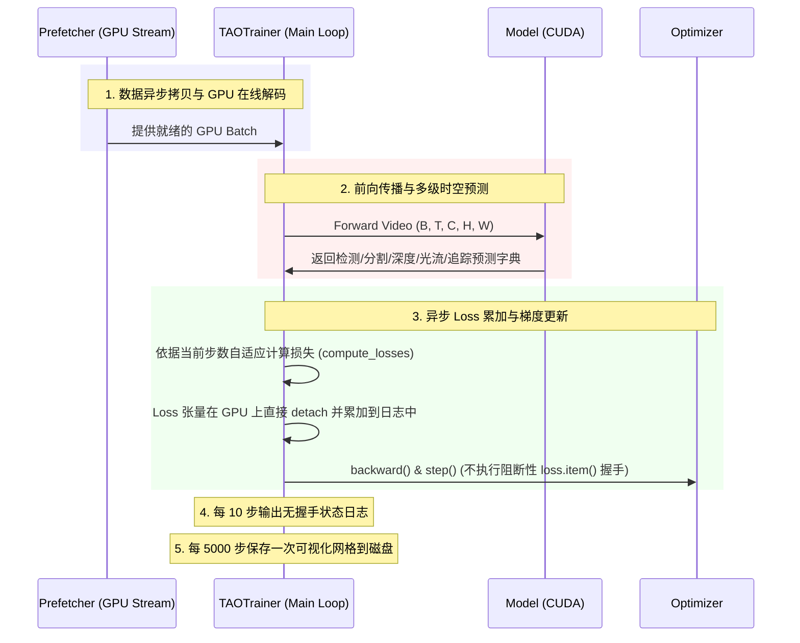

# TAOTrainer (多课程联合训练管理器)

`TAOTrainer` 是整个项目训练的“交响乐指挥家”。它负责整合异步数据流、视觉大模型、多层次课程损失调度、评估度量诊断以及可视化结果的周期性落盘。

---

## 1. 设计初衷与位置

物理常识与几何关系的无监督学习极难在单一损失或单一阶段一蹴而就。`TAOTrainer` 基于 **课程学习（Curriculum Learning）** 的核心思想，通过按步数（Step）动态调整时空损失的权重配比（Loss Scheduling），逐步引导网络从“识别静态目标”过度到“重建三维深度/光流”，直至“自监督追踪与时空异常预测”。

它集成了以下三大核心体系：
1. **Curriculum Scheduler**：多阶段损失自适应权重调度。
2. **Online Diagnostic Module**：在线自诊断模块，输出像素光流差（EPE）与深度绝对相对误差（AbsRel）等度量。
3. **Pipeline Accumulator**：去同步化主训练循环，保护 GPU 算子流平稳下发。

---

## 2. 类接口与参数说明

### 构造函数

```python
def __init__(self, model, prefetcher, optimizer, lr_scheduler=None, device="cuda", checkpoint_dir="checkpoints"):
```

| 参数 | 类型 | 描述 |
| :--- | :--- | :--- |
| `model` | `TAONot42VisionModel` | 集成了各自定义任务头与 YOLOE 的核心视觉大模型。 |
| `prefetcher` | `CUDAPrefetcher` | 绑定好的 GPU 异步数据预取器。 |
| `optimizer` | `torch.optim.Optimizer` | 训练优化器（通常为 AdamW）。 |
| `lr_scheduler` | `Scheduler` | 学习率衰减策略器。 |
| `device` | `str` | 计算硬件（必须为 `"cuda"`）。 |
| `checkpoint_dir` | `str` | 模型权重及训练状态的保存目录。 |

---

## 3. 课程损失表调度与多指标自诊断

### 3.1 三阶段课程调度（Gradual Curriculum Scheduling）
`TAOTrainer` 在训练主循环的 `get_loss_weights(step)` 中为损失引擎提供动态曲线支持：

1. **第一阶段：聚焦检测与深度 (Step: 0 ~ 2000)**
   - 激活目标检测、实例分割和单帧深度分支。
   - 损失配置：`obj: 1.0`, `box: 2.0`, `mask: 2.0`, `depth: 5.0`。
   - 目的：让 Backbone 快速学会基础的空间二维表征与物体轮廓。
2. **第二阶段：引入相机姿态与光流 (Step: 2000 ~ 5000)**
   - 激活连续位姿估计（Ego-Pose）与前后向光流预测。
   - 损失配置：`flow: 1.0`, `ego: 0.1`, 以及对光流和深度图的空间平滑约束 `smooth: 0.05`。
   - 目的：在三维几何坐标系下打通帧与帧之间的相对运动。
3. **第三阶段：激活时空异常自监督与端到端追踪 (Step: 5000+)**
   - 激活时空 Mamba 模块的特征预测机制（用于发现物理异常）与 Tracklet-Aware 时空匈牙利追踪分支。
   - 损失配置：`anom: 1.0`, `track: 1.0`, `attr: 0.5`（物理属性监督）。
   - 目的：实现最终的物理规律认知与高保真时序追踪闭环。

---

## 4. 训练流程与去同步化优化

为了确保 GPU 持续处于 90% 以上的高效利用状态，`TAOTrainer` 实现了以下优化运行路径：



- **无阻断日志系统**：在训练步骤内部，通过将浮点损失分离为 `detached GPU Tensor` 累加。只有在日志打印步骤（每 10 步）才整体转换一次为 CPU 标量，彻底切断了高频的主机-设备同步握手瓶颈。
- **自诊断在线度量**：集成评估组件，在训练期间直接计算真实和预测的：
  - **AbsRel (绝对相对深度误差)**
  - **RMSElog (对数均方根误差)**
  - **EPEpx (光流终点误差像素级)**
  无需中断训练进程，即可在控制台中对深度估计与运动光流的物理精度进行全面掌握与告警。
