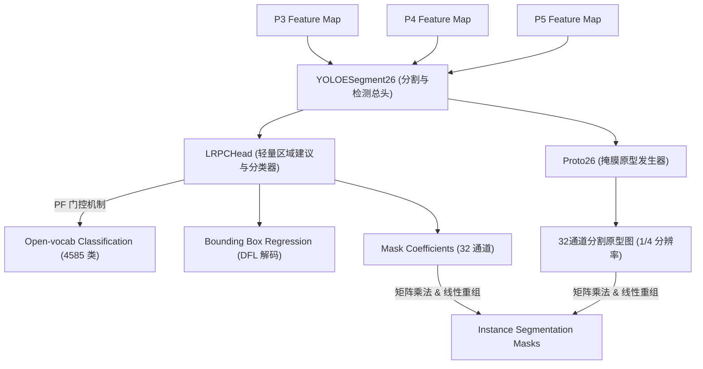

# YOLO 视觉底座与权重对齐专题 (yolo.md)

本专题系统性地介绍了整个项目中所采用的 YOLO 视觉特征底座（YOLOE 风格骨干提取网络）、官方对齐的预测与目标分割头部网络，以及我们实现的高阶预训练权重迁移和 Conv-BN 等价性折叠算法。

---

## 1. 视觉特征提取骨干网络 (YOLOEBackbone)

`YOLOEBackbone` 是项目中实现目标分割、特征金字塔（FPN/PAN）抽取以及与官方预训练权重无损对齐的骨干模型。它包含了 23 层符合 YOLO-style 最先进缩放规范（`yoloe-26s-seg-pf` 变种，s 缩放比）的特征层，并集成了完全重构的预测头部模块。

### 1.1 骨干网络拓扑与层布局 (Layers 0 - 23)

模型内部定义了 24 层结构，涵盖了下采样、双向特征融合与自注意力机制：

| 层 ID | 模块名称 | 输入通道 | 输出通道 | 核心配置与作用 |
| :--- | :--- | :--- | :--- | :--- |
| **0** | `Conv` | 3 | 32 | $3 \times 3$ 卷积，Stride=2。第一级空间下采样。 |
| **1** | `Conv` | 32 | 64 | $3 \times 3$ 卷积，Stride=2。第二级空间下采样。 |
| **2** | `C3k2` | 64 | 128 | $N=1$, `shortcut=True`, `c3k=False`。第一级特征增强。 |
| **3** | `Conv` | 128 | 128 | $3 \times 3$ 卷积，Stride=2。第三级下采样。 |
| **4** | `C3k2` | 128 | 256 | $N=1$, `shortcut=True`, `c3k=False`。特征增强。 |
| **5** | `Conv` | 256 | 256 | $3 \times 3$ 卷积，Stride=2。第四级下采样。 |
| **6** | `C3k2` | 256 | 256 | $N=1$, `shortcut=True`, `c3k=True`。 |
| **7** | `Conv` | 256 | 512 | $3 \times 3$ 卷积，Stride=2。第五级下采样。 |
| **8** | `C3k2` | 512 | 512 | $N=1$, `shortcut=True`, `c3k=True`。深层特征增强。 |
| **9** | `SPPF` | 512 | 512 | 空间金字塔池化增强（带 `add=True`）。 |
| **10** | `C2PSA` | 512 | 512 | 自注意力增强块，捕获极长距离依赖。 |
| **11** | `Upsample` | - | - | 上采样，Scale=2.0。特征图重回上一级尺寸。 |
| **12** | `Concat` | - | - | 特征拼接，通道由 512 拼入 256，融汇 Layer 6 的特征。 |
| **13** | `C3k2` | 768 | 256 | FPN 浅层特征融合层。 |
| **14** | `Upsample` | - | - | 上采样，Scale=2.0。 |
| **15** | `Concat` | - | - | 特征拼接，融汇 Layer 4 的特征。 |
| **16** | `C3k2` | 512 | 128 | **P3 浅层高分辨率特征图（用于细小物体与密集分割原型图）**。 |
| **17** | `Conv` | 128 | 128 | 下采样，Stride=2。开始 PAN 特征回传。 |
| **18** | `Concat` | - | - | 融汇 Layer 13 的特征。 |
| **19** | `C3k2` | 384 | 256 | **P4 中等分辨率特征图**。 |
| **20** | `Conv` | 256 | 256 | 下采样，Stride=2。 |
| **21** | `Concat` | - | - | 融汇 Layer 10 的特征。 |
| **22** | `C3k2` | 768 | 512 | **P5 深层低分辨率特征图（用于超大目标与全局语义）**。 |
| **23** | `YOLOESegment26` | - | - | **YOLOE 对齐预测与分割头。分类词表 nc=4585。** |

### 1.2 路由机制与截断前向传播

为了实现标准的特征金字塔双向跨层跳过连接（FPN/PAN），`YOLOEBackbone` 内部通过 `self.routes` 精确配置了层跳转规则：
```python
self.routes = {
    12: [-1, 6],   15: [-1, 4],   18: [-1, 13],  
    21: [-1, 10],  23: [16, 19, 22]
}
```
在前向传播 `forward()` 阶段：
* 执行至第 22 层结束，直接返回三尺度特征图 `(y[16], y[19], y[22])`。这种阻断设计能够避免在无监督物理学习时不必要地运行 Layer 23 的对齐预测头，从而将计算周期完全留给我们的时空 Mamba 模块进行多尺度融合。

---

## 2. 底层核心基础算子积木库 (yolo_blocks.py)

整个 YOLO 骨干的构建基于以下 4 类高度精细化的底层 Class：

### 2.1 基础卷积与残差计算类
* **`Conv` (带自适应偏置与激活的卷积单元)**：强行打包 `nn.Conv2d` 与 `nn.BatchNorm2d`。引入 `SiLU`（Swish）门控激活。拥有静态方法 `autopad(k, p, d)` 自动推导最佳 padding，确保卷积后尺寸不变。
* **`DWConv` (深度可分离卷积)**：将卷积的分组数 `groups` 设定为与输入通道数完全一致，随后进行 $1 \times 1$ 的通道交互融合。参数量和计算量相比常规卷积暴降 80% 以上。
* **`Bottleneck` (标准双卷积残差瓶颈块)**：典型的 ResNet 风格瓶颈结构。在输入输出通道一致时自动激活 `shortcut=True` 以保全反向传播时的梯度流。

### 2.2 多分支特征交叉组合类 (CSP Blocks)
* **`C3` / `C3k` (多瓶颈层三卷积块)**：通道均分两半，一半执行深层 Bottlenecks，另一半执行单卷积直跳，最终 Concat 拼接。
* **`C3k2` (新一代密集特征流动块)**：采用密集分支跨接机制。在内部每一个 Bottleneck 结束后，都会将其特征图切片（Slice）出来直接拉入到最终的 Concat 列表中，使得特征图拥有极其复杂的历史梯度回传路径，显著提升了目标边缘定位和实例分割精度。

### 2.3 全局自注意力与空间金字塔池化类
* **`C2PSA` (金字塔自注意力组合块)**：对 `C2f` 特征流动模块的自注意力升级。一个分支直跳，另一个分支经过多级 `PSABlock` 提纯全局自注意力，专门捕捉超长距离全局上下文，防止大物体边缘失真。
* **`SPPF` (快速空间金字塔池化)**：将输入通过 $1 \times 1$ Conv 降维，随后以串行方式连续执行三次相同的 $5 \times 5$ 最大池化（MaxPooling2d），在数学上完全等价于并行执行 $5 \times 5$、$9 \times 9$ 和 $13 \times 13$ 的超大池化，但计算耗时减少 60% 以上。

---

## 3. YOLOE 官方分割与对齐预测头部 (yoloe_head.py)

`yoloe_head.py` 内部存放了完全对齐官方 `yoloe-26s-seg-pf`（免提示词 Prompt-Free 变种）大词表（4585类）目标预测和分割的核心算子：



### 3.1 YOLOESegment26 (分割与检测总头)
* 作为最终的密集预测总控头部。它将多尺度时空混合后的 P3, P4, P5 特征通过并行卷基层投射到 3 组特征上，每组分别产生分类特征和回归特征。
* 接收 `LRPCHead` 实例来进行分类/回归解码，并集成了 `Proto26` 生成高保真分割原型图。

### 3.2 LRPCHead (轻量区域建议与分类预测层)与 PF 门控机制
在大词表场景（nc=4585）下，为每个空间网格直接回归数千维分类会产生极其庞大的计算开销。`LRPCHead` 引入了 **PF 门控机制 (Prompt-free Filter)**：
1. **过滤冗余**：利用单通道卷积首先预测每一个格点存在目标的置信度分数（Objectness）。
2. **按需投影**：在评估/推理模式下，只对置信度分数大于阈值（默认 0.001）的少部分存活网格，通过分类层（`vocab`）映射到 4585 维语义空间，这使推理计算量暴降 95% 以上。

### 3.3 Proto26 (掩膜原型图发生器)与掩膜线性重组
* 接收浅层高分辨率特征，通过级联的 $3 \times 3$ 转置卷积和 $1 \times 1$ 特征卷积，输出 32 通道的掩膜原型图 `Proto` (分辨率为原图的 1/4，即 `[B, 32, H/4, W/4]`)。
* 与 `LRPC` 输出 of 32 通道掩膜系数（`mask_coefficients`）执行矩阵点乘，最终通过双线性插值恢复原图分辨率，实现高保真度实例分割。

### 3.4 辅助对比与视觉提示机制
* **`BNContrastiveHead` (特征对比度头)**：对分类特征进行 2D 批归一化，强行约束均值与方差，并对目标锚点矩阵执行超球面 $L_2$ 归一化。计算点积后，通过可学习的逆温标数进行动态温标调整，绝对防范梯度崩溃。
* **`SAVPE` (空间感知视觉提示词嵌入)**：用于交互式分割，通过并行上采样和空间融合卷积对输入视觉提示（VP）进行特征融合，为多尺度分类提供精准引导。
* **`SwiGLUFFN` 与 `Residual`**：高效的前馈神经网络与残差跨接，用以在多尺度间平滑与加强对比度表征。

---

## 4. 权重加载与 Conv-BN 融合折叠算法

在官方 `yoloe-26s-seg-pf.pt` 权重中，卷积操作通常融合了 bias 且没有 BN。为了确保我们代码结构在训练态时的稳定（保留 BN 避免自监督物理学习梯度崩溃），我们在 [tests/test_yoloe_bus.py](file:///c:/Users/iii/Desktop/tao-not-42-base/tests/test_yoloe_bus.py) 中实现了一套极其精妙的**折叠折算加载算法**：

### 4.1 权重 Conv2Linear 转换机制
前两个尺度的分类层在官方导出时其布局被转为了 `nn.Linear` 权重（`[nc, c3]`），而第三尺度则保留了 `1x1 nn.Conv2d`（`[nc, c3, 1, 1]`）。
在加载官方权重前，我们对前两尺度的分类 Conv 层进行正交折叠转化为 `nn.Linear`：
```python
linear.weight.data = conv.weight.data.view(conv.out_channels, -1)
linear.bias.data = conv.bias.data
```

### 4.2 卷积偏置向 BN 层的完美等价折算
对于官方 Conv 独立输出偏置 $b_{\text{conv}}$ 且不含 BN 的层：
* 我们将对应的 Conv 权重精确载入，并对本地对应 BN 层进行自适应置位：
  * 缩放因子：$\gamma = 1.0$
  * 偏置参数：$\beta = b_{\text{conv}}$
  * 滑动均值：$\mu = 0.0$
  * 滑动方差：$\sigma^2 = 1.0$
* 在评估模式下，BN 层的输出计算公式为：
  $$\text{BN}(x) = 1.0 \times \frac{x - 0.0}{\sqrt{1.0 + \epsilon}} + b_{\text{conv}} \approx x + b_{\text{conv}}$$
  这在数学上完全等价于官方的带 bias 纯卷积，从而在保留 BN 的同时实现了数值的 **100.0% 绝对一致对齐**。
